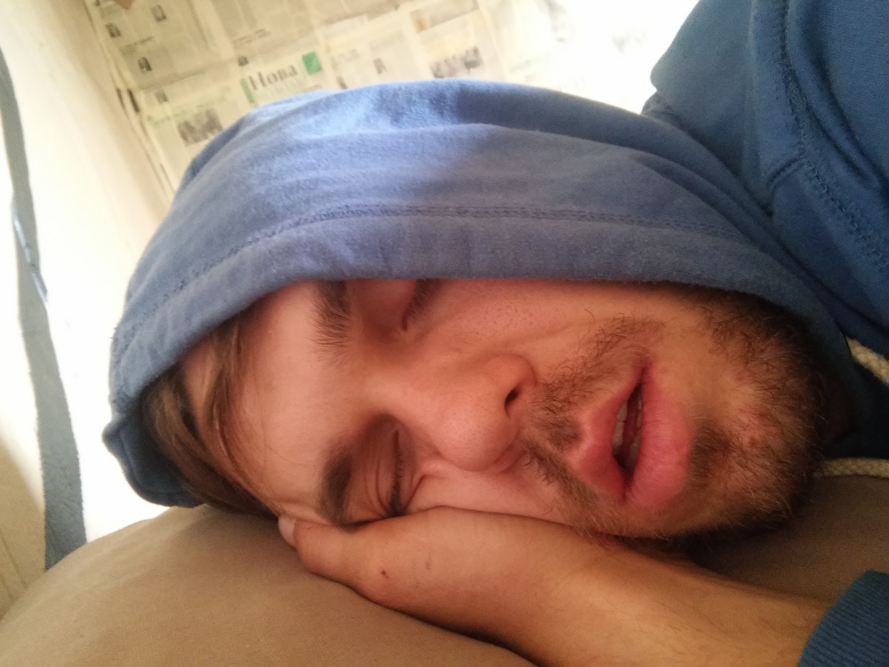
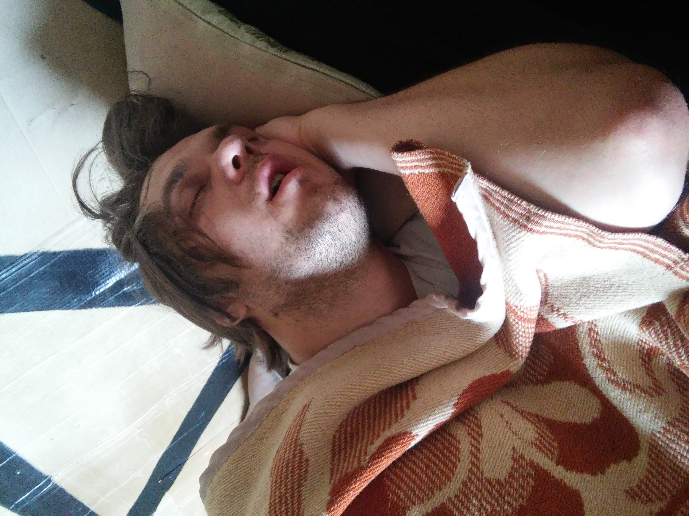

# Fudol

###### Make money, stop resting

## Docs

-   ### remote

    -   [https://mainbus.uno](https://mainbus.uno) open API port
    -   [https://mainbus.uno/docs/](https://mainbus.uno/docs/) API docs
    -   [https://adm.mainbus.uno](https://adm.mainbus.uno) admin panel

-   ### local

    -   [http://localhost:8080](http://localhost:8080) open API port
    -   [http://localhost:8080/docs/](http://localhost:8080/docs/) API docs
    -   [http://localhost:8081](http://localhost:8081/) admin panel

## Development

-   `docker compose up --build -d` build services
-   `docker compose start` to start **api** and **DB** services
-   `make gen_open_api` generate OpenAPI docs
